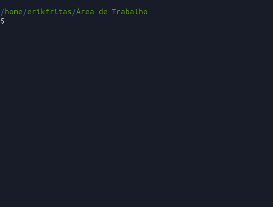

# PHP_Terminal
🐘 A Terminal made in PHP

## How to use:
Open your terminal in the folder where the "terminal.php" file you downloaded is located and type:
```
sudo php terminal.php
```



Made by me, feel free to edit it any way you want
